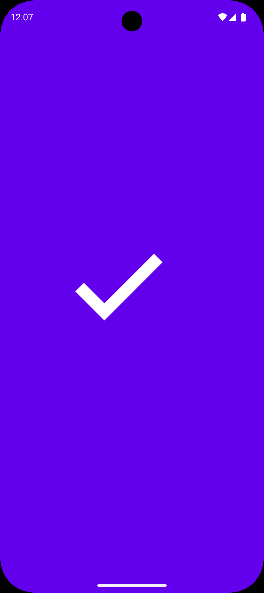
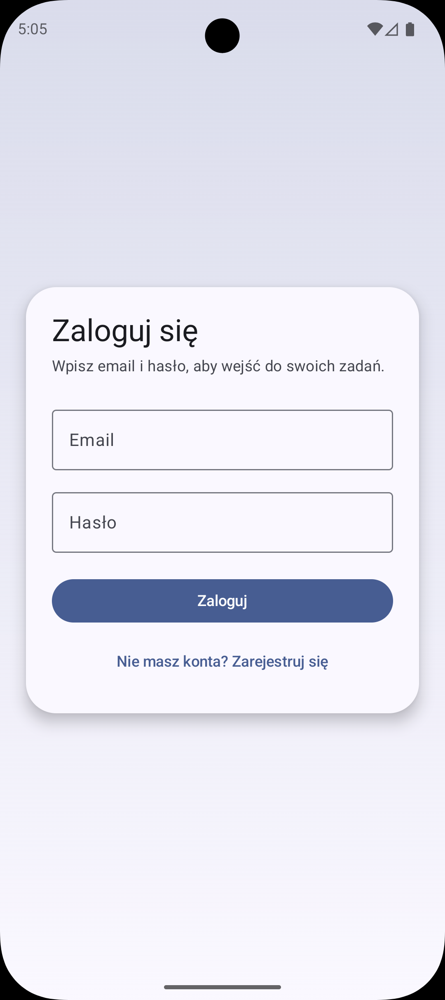
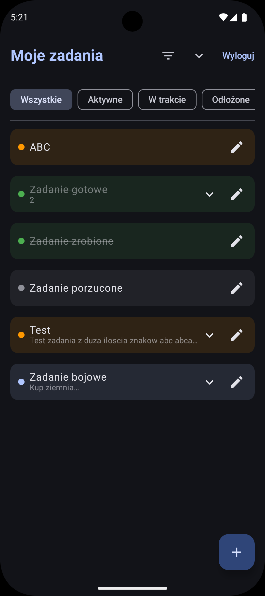
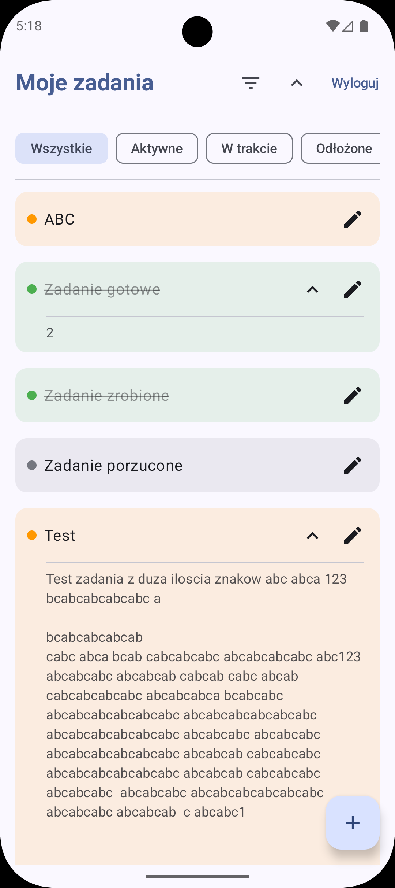
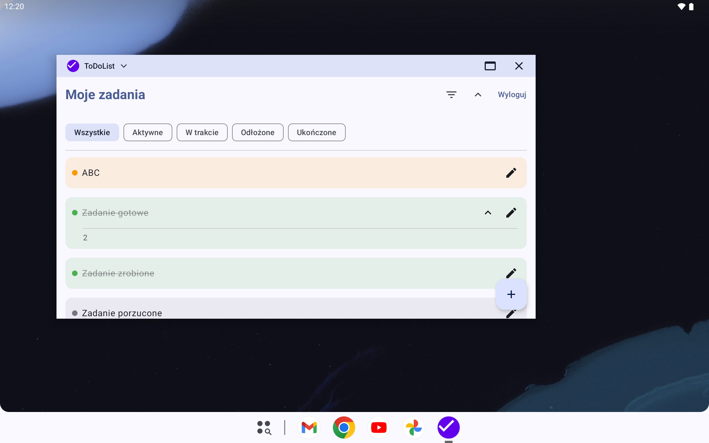
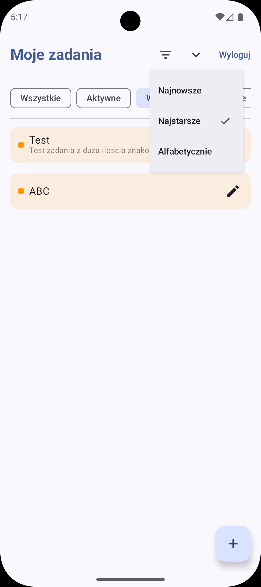

# ToDoList Android App

A modern, clean, and feature-rich To-Do List application built with the latest Android technologies.

## Features

- **User Authentication**: Secure login and account management via Firebase Auth.
- **Real-time Sync**: Tasks are synchronized across devices using Firebase Firestore.
- **Local Persistence**: Offline support powered by Room Database for fast and reliable access.
- **Modern UI**: Built entirely with **Jetpack Compose** and **Material 3**.
- **Advanced Task Management**:
  - **Filter**: View tasks by status (Active, In Progress, On Hold, Completed).
  - **Sort**: Organize tasks by date (newest/oldest) or alphabetically.
  - **Quick Actions**: Swipe to delete tasks and intuitive tap to edit.
- **Polished UX**:
  - Smooth animations.
  - Modern Splash Screen.
  - Fast and responsive gesture-based interactions.

## Screenshots

Splash Screen  

Login Screen  

Dark and light theme support  

Task Expansion  

Responsive design  

Filter & Sort  

## Tech Stack

- **Language**: Kotlin 2.2.10 (using K2 compiler)
- **UI Framework**: Jetpack Compose with Material 3
- **Dependency Management**: Gradle Version Catalog (`libs.versions.toml`)
- **Database**: Room (v2.8.4) with KSP 2.0 support
- **Backend**: Firebase (Auth & Firestore)
- **Architecture**: MVVM with StateFlow and Coroutines
- **Processing**: Kotlin Symbol Processing (KSP)

## Getting Started

### Prerequisites
- Android Studio Ladybug (or newer)
- JDK 17
- A Firebase project with Auth and Firestore enabled

### Setup
1. Clone the repository.
2. Add your `google-services.json` file to the `app/` directory.
3. Sync the project with Gradle.
4. Build the app and run it on an emulator or physical device.

## Design & UX

The app follows Material 3 design principles, featuring:
- **Dynamic Color Support**: Adapts to the user's system theme on Android 12+.
- **Cohesive Color Palette**: A refined UI with task highlighting.
- **Adaptive Themes**: Full support for **Light and Dark modes**, with optimized contrast and accessibility.
- **Responsive Layout**:
  - Built using a **composable-first** approach to handle different screen sizes.
  - Uses adaptive components and flexible layouts that look great on both compact phones and larger displays.
- **Custom App Icon**: Unique adaptive icon with a modern checkmark design.

---
Developed by:
- Mateusz Gieszczyk, 95009
- Dawid Jakubowski, 95983
- Kacper Weryszko, 94998
